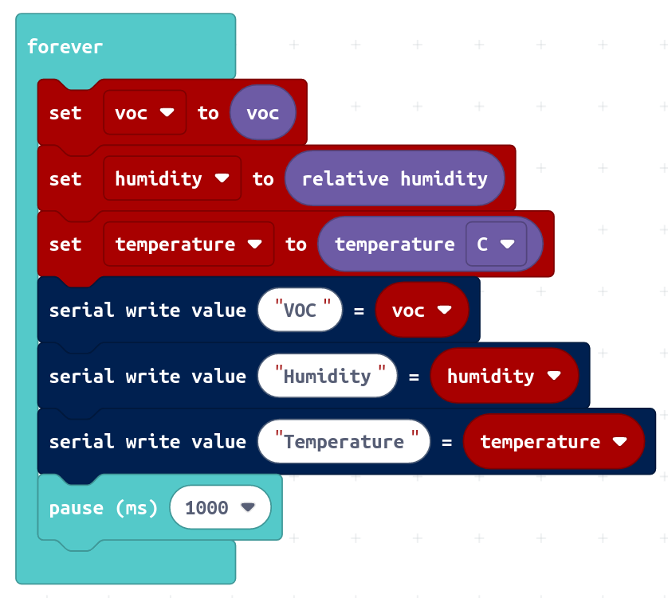

# Sensirion SVM40 Makecode Extension

Makecode extension for the Sensirion SVM40 evaluation kit connected to the micro:bit platform.

This extension allows you to read VOC (Volatile Organic Components), temperature and relative humidity values with an interval of 1 second.


[<center></center>](https://www.sensirion.com/my-sgp-ek/)


## SVM40 Evaluation Kit

For more information and further documentation, please visit the product homepage:
[SVM40 Product Homepage](https://www.sensirion.com/en/environmental-sensors/evaluation-kit-sek-environmental-sensing/evaluation-kit-sek-svm40/)


#### Where to buy


**Global**

* [Mouser](https://eu.mouser.com/ProductDetail/Sensirion/SEK-SVM40?qs=yqaQSyyJnNhxsYvNswapqA==)
* [DigiKey](https://www.digikey.com/en/products/detail/SEK-SVM40/1649-SEK-SVM40-ND/12820417?WT.z_cid=ref_netcomponents_dkc_buynow&utm_source=netcomponents&utm_medium=aggregator&utm_campaign=buynow)


**Americas**

* [Newark](https://www.newark.com/sensirion/sek-svm40/evaluation-kit-gas-sensor/dp/84AH2023?CMP=AFC-NETCOMPONENTS)


**Europa**

* [Farnell](https://uk.farnell.com/sensirion/sek-svm40/evaluation-kit-gas-sensor/dp/3573528?CMP=GRHB-NETCOMP)


**Asia**

* [Element14](https://sg.element14.com/sensirion/sek-svm40/evaluation-kit-gas-sensor/dp/3573528?CMP=GRHB-NETCOMP)


## Supported Targets

* PXT/microbit
* Calliope mini

## I2C Address

* 0x6A

## Usage

open your microbit makecode project, in "+ Extension", paste the following URL:

https://github.com/Sensirion/makecode-extension-svm40

## Demo



## API

Get VOC value in ppb (parts per billion)
```ts
function get_voc()
```

Get temperature in degree celsius. Takes an optional argument to change to fahrenheit.
```ts
function get_temperature()
```

Get relative humidity in percent
```ts
function get_relative_humidity()
```

Start measurement on SVM40 evaluation kit. This method will be automatically called on initialization.
If you call `stop_continuous_measurement()` you have to call this method again before voc, temperature and humidity
values can be retrieved again.
```ts
function start_continuous_measurement()
```

Stop measurement on SVM40 evaluation kit. After calling this function, no more sensor values can be read out
anymore until you call `start_continuous_measurement`
```ts
function stop_continuous_measurement()
```


## License

[MIT](LICENSE)

Copyright (c) 2021, Sensirion AG

